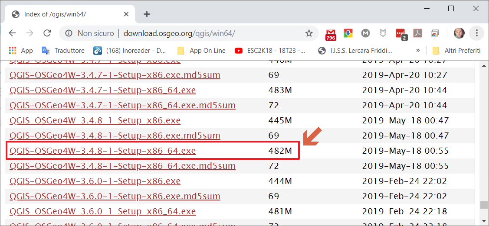
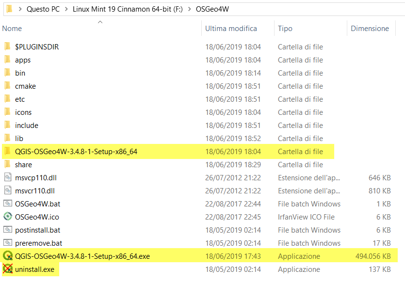

<!-- TOC -->

- [QGIS portable 3.x](#QGIS-portable-3x)
  - [Perché questo repository](#Perch%C3%A9-questo-repository)
  - [Che cosa è una versione Portable](#Che-cosa-%C3%A8-una-versione-Portable)
  - [Step by step metodo manuale](#Step-by-step-metodo-manuale)
  - [Step by step usando script Bash](#Step-by-step-usando-script-Bash)
  - [Connessione al Web e i Plugin](#Connessione-al-Web-e-i-Plugin)

<!-- /TOC -->
# QGIS portable 3.x

Creare una versione **Portable di QGIS 3.x** usando il file `*.exe` scaricato dal sito http://download.osgeo.org/qgis/

## Perché questo repository

Per tenere traccia di come realizzare una **versione Portable di QGIS 3.x** senza necessariamente aver installato il software.

## Che cosa è una versione Portable

Per applicazione portabile (o applicazione portatile; in inglese portable application) si intende un software applicativo che non necessita di installazione all’interno del sistema operativo su cui viene eseguito. Programmi di questo genere possono essere memorizzati su supporto rimovibile come cd-rom o memorie flash. 
Un’applicazione portabile può indistintamente essere eseguita su qualsiasi computer in cui si dispone di un sistema operativo compatibile con l’applicazione stessa. Il vantaggio per l’utente è quindi quello di poter utilizzare la medesima applicazione su macchine diverse mantenendo le impostazioni personalizzate nell’uso dell’applicazione. Un secondo vantaggio delle applicazioni portabili deriva dal fatto che non richiedendo installazione possono spesso essere eseguite anche in ambienti in cui non si dispone dei diritti di amministrazione sul sistema operativo. [Wikipedia](https://it.wikipedia.org/wiki/Applicazione_portabile).

## Step by step metodo manuale

1. Inserire una **pen drive** nel PC, nel mio caso unità `F:`;
2. Creare la cartella **OSGeo4W**;
3. Scaricare la versione di **QGIS** (32 o 64 bit) desiderata;

 

 io ho scaricoto questa: **QGIS-OSGeo4W-3.4.8-1-Setup-x86_64.exe**

 

4. Unzippare il file ***.exe** e spostare tutta la cartella **QGIS-OSGeo4W-3.4.8-1-Setup-x86_64** all'interno della cartella **OSGeo4W** presente nella pen drive (`F:\OSGeo4W\OSGeo4W-3.4.1-1-Setup-x86_64`);
5. Spostare tutto il contenuto della cartella `F:\OSGeo4W\OSGeo4W-3.4.1-1-Setup-x86_64\$_25_\` nella cartella `F:\OSGeo4W\`;
6. Cercare il file `F:\OSGeo4W\bin\qgis-ltr.bat.tmpl` (nel caso di versione non LTR, il file sarebbe `qgis.bat.tmpl`) creare una copia e rinominarlo in `qgis-ltr.bat` in modo da ottenere `F:\OSGeo4W\bin\qgis-ltr.bat`;
7. Cercare e copiare i file `msvcp100.dll` `msvcr100.dll` nella cartella `c:\windows\syswow64` (nel caso `c:\windows\system32`) e incollarli nella cartella `F:\OSGeo4W\apps\qgis\bin\`
8. Lanciare `F:\OSGeo4W\bin\qgis-ltr.bat` e magicamente si avvierà **QGIS!!!** (in questo caso QGIS 3.4.8 LTR)

 

Nella pen drive: (quelli evidenziato non servono più)

 

Buon lavoro!!!

 

## Step by step usando script Bash

1. creare una cartella sul desktop `zanzibar`(oppure dove preferite);
2. scaricare il file [script.sh](./script.sh) all'interno della cartella `zanzibar` creata al punto 1;
3. avviare `Bash` e digitare `chmod +x ./script.sh` per i permessi e poi `./script.sh`;
4. dopo circa **30 minuti** otterrete una cartella zippata `OSGeo4W_349` con la versione portable di QGIS.
5. unzippate la cartella `OSGeo4W_349.7z` dove desiderate e avvire il file `qgis-ltr.bat` che trovate in `/OSGeo4W/bin`.

**PS:** nello script scarico la `QGIS-OSGeo4W-3.4.9-1-Setup-x86_64.exe` e i file `msvcp100.dll` `msvcr100.dll` versione a 64 bit!!!

---
## Connessione al Web e i Plugin

Ho fatto dei test, la **portable** si connette alla rete senza problemi.

Per quanto riguarda i **plugin**: è possibile installarli, ma verrà creata una cartella **QGIS** nel percorso relativo al profilo utente `C:\Users\nomeUtente\AppData\Roaming\QGIS\QGIS3\profiles\default`

---

**Riferimenti:**

- Idea presa da [qui](https://www.youtube.com/watch?v=iWbB0WPn6rM)
- [QGIS 3.4.8 LTR Portable](https://mega.nz/#!dQBBzabA!NW76-W72lA7hCwvK9HDukHIWw_A1pOdjXvTdxOeAGLU) (da unzippare in una pen drive `F:\OSGeo4W` e eseguire punto 8)(al primo avvio potrebbe non funzionare, quindi tentare almeno due volte... ci stiamo lavorando per risolvere il bug!)
- [QGIS 3.4.9 LTR Portable](https://mega.nz/#!UYRRFYIY!xljwwxNunudCoGwnvajNHjOuJf35TVYER-TyPx9-5LA) (da unzippare in una pen drive `F:\OSGeo4W` e eseguire punto 8)(al primo avvio potrebbe non funzionare, quindi tentare almeno due volte... ci stiamo lavorando per risolvere il bug!)
- [QGIS 3.8.0 Zanzibar Portable](https://mega.nz/#!xNoUDSKZ!j3yRI0DOGI6AtP_NdqLLsIDSXYX0dbXcaLsoIOcHHFQ) (da unzippare in una pen drive `F:\OSGeo4W` e eseguire punto 8)(al primo avvio potrebbe non funzionare, quindi tentare almeno due volte... ci stiamo lavorando per risolvere il bug!)
- Blog post su [Pigrecoinfinito](https://pigrecoinfinito.wordpress.com/2019/02/26/creare-una-versione-portable-di-qgis-2-18-ltr/)

**DISCLAIMER**

Questa guida è stata realizzata e testata nel mio laptop e funziona bene, si connette al web. Non mi assumo nessuna responsabilità su eventuali incidenti di percorso!!!

 

