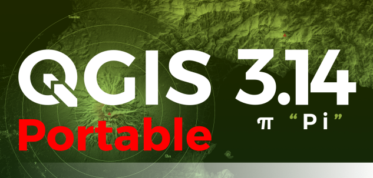
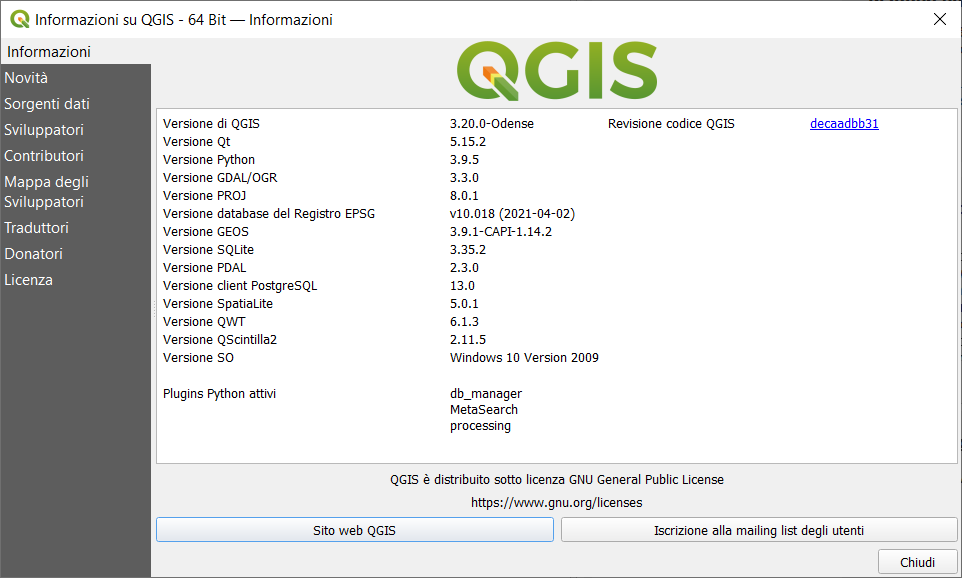
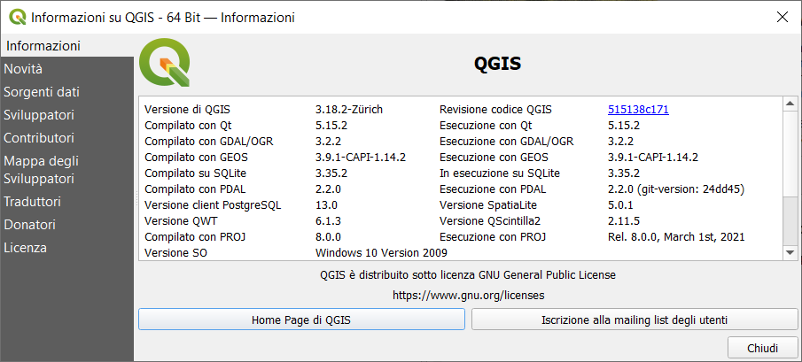

<!-- TOC -->

- [QGIS portable 3.x](#qgis-portable-3x)
  - [Perché questo repository](#perché-questo-repository)
  - [Che cosa è una versione Portable](#che-cosa-è-una-versione-portable)
  - [Step by step metodo manuale](#step-by-step-metodo-manuale)
  - [Step by step usando script Bash](#step-by-step-usando-script-bash)
  - [Connessione al Web e i Plugin](#connessione-al-web-e-i-plugin)
  - [Portable (7z)](#portable-7z)
    - [Con GRASS GIS 7.8, SAGA GIS 7.8.2, SpatiaLite 5, PDAL 2.2 - solo per win 10 64 bit](#con-grass-gis-78-saga-gis-782-spatialite-5-pdal-22---solo-per-win-10-64-bit)
    - [Con GRASS GIS 7.8](#con-grass-gis-78)
    - [GRASS GIS non abilitato](#grass-gis-non-abilitato)

<!-- /TOC -->
# QGIS portable 3.x

Creare una versione **Portable di QGIS 3.x** usando il file `*.exe` scaricato dal sito http://download.osgeo.org/qgis/

## Perché questo repository

Per tenere traccia di come realizzare una **versione Portable di QGIS 3.x** senza necessariamente aver installato il software.

## Che cosa è una versione Portable

Per applicazione portabile (o applicazione portatile; in inglese portable application) si intende un software applicativo che non necessita di installazione all’interno del sistema operativo su cui viene eseguito. Programmi di questo genere possono essere memorizzati su supporto rimovibile come cd-rom o memorie flash. 
Un’applicazione portabile può indistintamente essere eseguita su qualsiasi computer in cui si dispone di un sistema operativo compatibile con l’applicazione stessa. Il vantaggio per l’utente è quindi quello di poter utilizzare la medesima applicazione su macchine diverse mantenendo le impostazioni personalizzate nell’uso dell’applicazione. Un secondo vantaggio delle applicazioni portabili deriva dal fatto che non richiedendo installazione possono spesso essere eseguite anche in ambienti in cui non si dispone dei diritti di amministrazione sul sistema operativo. [Wikipedia](https://it.wikipedia.org/wiki/Applicazione_portabile).

## Step by step metodo manuale

1. Inserire una **pen drive** nel PC, nel mio caso unità `F:`;
2. Creare la cartella **OSGeo4W**;
3. Scaricare la versione di **QGIS** (32 o 64 bit) desiderata;

 

 io ho scaricoto questa: **QGIS-OSGeo4W-3.4.8-1-Setup-x86_64.exe**

 

4. Unzippare il file ***.exe** e spostare tutta la cartella **QGIS-OSGeo4W-3.4.8-1-Setup-x86_64** all'interno della cartella **OSGeo4W** presente nella pen drive (`F:\OSGeo4W\OSGeo4W-3.4.1-1-Setup-x86_64`);
5. Spostare tutto il contenuto della cartella `F:\OSGeo4W\OSGeo4W-3.4.1-1-Setup-x86_64\$_25_\` nella cartella `F:\OSGeo4W\`;
6. Cercare il file `F:\OSGeo4W\bin\qgis-ltr.bat.tmpl` (nel caso di versione non LTR, il file sarebbe `qgis.bat.tmpl`) creare una copia e rinominarlo in `qgis-ltr.bat` in modo da ottenere `F:\OSGeo4W\bin\qgis-ltr.bat`;
7. Cercare e copiare i file `msvcp100.dll` `msvcr100.dll` nella cartella `c:\windows\syswow64` (nel caso `c:\windows\system32`) e incollarli nella cartella `F:\OSGeo4W\apps\qgis\bin\`
8. Lanciare `F:\OSGeo4W\bin\qgis-ltr.bat` e magicamente si avvierà **QGIS!!!** (in questo caso QGIS 3.4.8 LTR)

 

Nella pen drive: (quelli evidenziato non servono più)

 

Buon lavoro!!!

 

## Step by step usando script Bash

1. creare una cartella sul desktop `zanzibar`(oppure dove preferite);
2. scaricare il file [script.sh](./script.sh) all'interno della cartella `zanzibar` creata al punto 1;
3. avviare `Bash` e digitare `chmod +x ./script.sh` per i permessi e poi `./script.sh`;
4. dopo circa **30 minuti** otterrete una cartella zippata `OSGeo4W_349` con la versione portable di QGIS.
5. unzippate la cartella `OSGeo4W_349.7z` dove desiderate e avvire il file `qgis-ltr.bat` che trovate in `/OSGeo4W/bin`.

**PS:** nello script scarico la `QGIS-OSGeo4W-3.4.9-1-Setup-x86_64.exe` e i file `msvcp100.dll` `msvcr100.dll` versione a 64 bit!!!

---
## Connessione al Web e i Plugin

Ho fatto dei test, la **portable** si connette alla rete senza problemi.

Per quanto riguarda i **plugin**: è possibile installarli, ma verrà creata una cartella **QGIS** nel percorso relativo al profilo utente `C:\Users\nomeUtente\AppData\Roaming\QGIS\QGIS3\profiles\default`

---

**Riferimenti:**

- Idea presa da [qui](https://www.youtube.com/watch?v=iWbB0WPn6rM)
- Blog post su [Pigrecoinfinito](https://pigrecoinfinito.wordpress.com/2019/02/26/creare-una-versione-portable-di-qgis-2-18-ltr/)

## Portable (7z)

### Con GRASS GIS 7.8, SAGA GIS 7.8.2, SpatiaLite 5, PDAL 2.2 - solo per win 10 64 bit

 

 

- [QGIS 3.20.1-2 Odense Portable](in lavorazione) (da unzippare in una pen drive (o dove preferite) `F:\QGIS-OSGeo4W-3.20.1-2`, doppio clic su `qgis-grass.bat`)(è una prima versione da testare, ogni suggerimento o segnalazione sono benvenute)
- **QGIS 3.20.1-1 Odense Portable** (grave bug, uso sconsigliato)
- [QGIS 3.20.0-4 RC Odense Portable](https://drive.google.com/file/d/15QNiABWFlBfvxoGAFxJqUThT25Kenwqe/view?usp=sharing) (da unzippare in una pen drive (o dove preferite) `F:\QGIS-OSGeo4W-3.20.0-4`, doppio clic su `qgis-grass.bat`)(è una prima versione da testare, ogni suggerimento o segnalazione sono benvenute)
- [QGIS 3.18.2-1 Zürich Portable](https://drive.google.com/file/d/1C04vJNz43dMaVAua3yT_u7e4UasFmLgx/view?usp=sharing) (da unzippare in una pen drive (o dove preferite) `F:\OSGeo4W_31821-testing`, doppio clic su `qgis-grass.bat`)(è una prima versione da testare, ogni suggerimento o segnalazione sono benvenute) [Grazie per l'aiuto a [Andrea Giudiceandrea](https://github.com/agiudiceandrea)]

### Con GRASS GIS 7.8

- [QGIS 3.16.16-1 Hannover Portable Grass 7.8.5 LTR](https://drive.google.com/file/d/1ylrcrQKjpz4AEQPLyAKSZac-EhKpcBAR/view?usp=sharing) (da unzippare in una pen drive `F:\OSGeo4W`, doppio clic su `qgis-grass.bat`)(al primo avvio potrebbe non funzionare, quindi tentare almeno due volte... ci stiamo lavorando per risolvere il bug!)
- [QGIS 3.16.15-1 Hannover Portable Grass 7.8.5 LTR](https://drive.google.com/file/d/18m4DNSkfXAoBbpcnaasrXzmWhHbZvpGA/view?usp=sharing) (da unzippare in una pen drive `F:\OSGeo4W`, doppio clic su `qgis-grass.bat`)(al primo avvio potrebbe non funzionare, quindi tentare almeno due volte... ci stiamo lavorando per risolvere il bug!)
- [QGIS 3.16.14-1 Hannover Portable Grass 7.8.5 LTR](https://drive.google.com/file/d/1-2kJBHUOvlJZlQq7oNyPl8AMFwki8soC/view?usp=sharing) (da unzippare in una pen drive `F:\OSGeo4W`, doppio clic su `qgis-grass.bat`)(al primo avvio potrebbe non funzionare, quindi tentare almeno due volte... ci stiamo lavorando per risolvere il bug!)
- [QGIS 3.16.13-1 Hannover Portable Grass 7.8.5 LTR](è la stessa della 3.16.12, creata solo per motivi di BUG presenti nella MSI) (da unzippare in una pen drive `F:\OSGeo4W`, doppio clic su `qgis-grass.bat`)(al primo avvio potrebbe non funzionare, quindi tentare almeno due volte... ci stiamo lavorando per risolvere il bug!)
- [QGIS 3.16.12-1 Hannover Portable Grass 7.8.5 LTR](https://drive.google.com/file/d/1-2KVy3j0WzOVQ2u2mxybSUgOUADPFqSx/view?usp=sharing) (da unzippare in una pen drive `F:\OSGeo4W`, doppio clic su `qgis-grass.bat`)(al primo avvio potrebbe non funzionare, quindi tentare almeno due volte... ci stiamo lavorando per risolvere il bug!)
- [QGIS 3.16.11-1 Hannover Portable Grass 7.8.5 LTR](https://drive.google.com/file/d/1-1We95MgGXEzIyEoRVe4YA1K3SjlygU6/view?usp=sharing) (da unzippare in una pen drive `F:\OSGeo4W`, doppio clic su `qgis-grass.bat`)(al primo avvio potrebbe non funzionare, quindi tentare almeno due volte... ci stiamo lavorando per risolvere il bug!)
- [QGIS 3.16.10-1 Hannover Portable Grass 7.8.5 LTR](https://drive.google.com/file/d/1XXnPxAXnWunDOS0tZ3YR9L83quORmEpK/view?usp=sharing) (da unzippare in una pen drive `F:\OSGeo4W`, doppio clic su `qgis-grass.bat`)(al primo avvio potrebbe non funzionare, quindi tentare almeno due volte... ci stiamo lavorando per risolvere il bug!)
- [QGIS 3.16.9-1 Hannover Portable Grass 7.8.5 LTR](https://drive.google.com/file/d/1AXUHhw3Py-JTAxqcGayhA1NIxP8dnwZA/view?usp=sharing) (da unzippare in una pen drive `F:\OSGeo4W`, doppio clic su `qgis-grass.bat`)(al primo avvio potrebbe non funzionare, quindi tentare almeno due volte... ci stiamo lavorando per risolvere il bug!)
- [QGIS 3.16.8-1 Hannover Portable Grass 7.8.5 LTR](https://drive.google.com/file/d/1D2DYM2GnercZztNZVCbPFWVX7stpMeCr/view?usp=sharing) (da unzippare in una pen drive `F:\OSGeo4W`, doppio clic su `qgis-grass.bat`)(al primo avvio potrebbe non funzionare, quindi tentare almeno due volte... ci stiamo lavorando per risolvere il bug!)
- [QGIS 3.18.3-1 Zürich Portable Grass 7.8.5](https://drive.google.com/file/d/1EKdhBlfImdJNdHBFfCVSZU2EwtJzaXQg/view?usp=sharing) (da unzippare in una pen drive `F:\OSGeo4W`, doppio clic su `qgis-grass.bat`)(al primo avvio potrebbe non funzionare, quindi tentare almeno due volte... ci stiamo lavorando per risolvere il bug!)
- [QGIS 3.16.7-1 Hannover Portable Grass 7.8.5 LTR](https://drive.google.com/file/d/18AncD24y2DPmWVW9Cp5mYKOE_t1YUMLg/view?usp=sharing) (da unzippare in una pen drive `F:\OSGeo4W`, doppio clic su `qgis-grass.bat`)(al primo avvio potrebbe non funzionare, quindi tentare almeno due volte... ci stiamo lavorando per risolvere il bug!)
- [QGIS 3.18.2-1 Zürich Portable Grass 7.8.5](https://drive.google.com/file/d/1r2wb2psRJlg_3Dw_hErEQsblJpC7MuuD/view?usp=sharing) (da unzippare in una pen drive `F:\OSGeo4W`, doppio clic su `qgis-grass.bat`)(al primo avvio potrebbe non funzionare, quindi tentare almeno due volte... ci stiamo lavorando per risolvere il bug!)
- [QGIS 3.16.6-1 Hannover Portable Grass 7.8.5 LTR](https://drive.google.com/file/d/1em9phgWHZd_gDM2ItiliYWBOEFMx1rOS/view?usp=sharing) (da unzippare in una pen drive `F:\OSGeo4W`, doppio clic su `qgis-grass.bat`)(al primo avvio potrebbe non funzionare, quindi tentare almeno due volte... ci stiamo lavorando per risolvere il bug!)
- [QGIS 3.18.1-1 Zürich Portable Grass 7.8.5](https://drive.google.com/file/d/1WWyjI85c6lAXI4rdX6qMznHEVdE4Kz2I/view?usp=sharing) (da unzippare in una pen drive `F:\OSGeo4W`, doppio clic su `qgis-grass.bat`)(al primo avvio potrebbe non funzionare, quindi tentare almeno due volte... ci stiamo lavorando per risolvere il bug!)
- [QGIS 3.16.5-1 Hannover Portable Grass 7.8.5 - NUOVA LTR](https://drive.google.com/file/d/1iXH2ZbJ1E4So8p67yePiAr1U5aSzydvm/view?usp=sharing) (da unzippare in una pen drive `F:\OSGeo4W`, doppio clic su `qgis-grass.bat`)(al primo avvio potrebbe non funzionare, quindi tentare almeno due volte... ci stiamo lavorando per risolvere il bug!)
- **QGIS 3.18.0-1 Zürich** **RITIRATA** (per gravi BUG)
- [QGIS 3.16.4-1 Hannover Portable Grass 7.8.5](https://drive.google.com/file/d/1QarJdO5Ejap1fnR6Abw9ATJZ0mz9mgAF/view?usp=sharing) (da unzippare in una pen drive `F:\OSGeo4W`, doppio clic su `qgis-grass.bat`)(al primo avvio potrebbe non funzionare, quindi tentare almeno due volte... ci stiamo lavorando per risolvere il bug!)
- [QGIS 3.16.3-1 Hannover Portable Grass 7.8.5](https://drive.google.com/file/d/1rFU_jr06Uye94H_x7ebW4o_YCiHsomQi/view?usp=sharing) (da unzippare in una pen drive `F:\OSGeo4W`, doppio clic su `qgis-grass.bat`)(al primo avvio potrebbe non funzionare, quindi tentare almeno due volte... ci stiamo lavorando per risolvere il bug!)
- [QGIS 3.10.14-1 A Coruña Portable Grass 7.8.5 - ultima LTR](https://drive.google.com/file/d/1nCcqao0Fs7vbynvoBhCH9F7IZR56zbGZ/view?usp=sharing) (da unzippare in una pen drive `F:\OSGeo4W`, doppio clic su `qgis-grass.bat`)(al primo avvio potrebbe non funzionare, quindi tentare almeno due volte... ci stiamo lavorando per risolvere il bug!)
- [QGIS 3.16.2-2 Hannover Portable Grass 7.8.5](https://drive.google.com/file/d/16j98oyuNHdI6mzyxqb1LQW_O9EhP4VrV/view?usp=sharing) (da unzippare in una pen drive `F:\OSGeo4W`, doppio clic su `qgis-grass.bat`)(al primo avvio potrebbe non funzionare, quindi tentare almeno due volte... ci stiamo lavorando per risolvere il bug!)
- [QGIS 3.10.13-2 A Coruña Portable Grass 7.8.5](https://drive.google.com/file/d/1bcYf5ymAnC0QDwZBiz6jOnXGyrSjPyu5/view?usp=sharing) (da unzippare in una pen drive `F:\OSGeo4W`, doppio clic su `qgis-grass.bat`)(al primo avvio potrebbe non funzionare, quindi tentare almeno due volte... ci stiamo lavorando per risolvere il bug!)
- [QGIS 3.16.1-1 Hannover Portable](https://drive.google.com/file/d/1V478AX6M704k6XqBqpeCo6u3T6EDdyHY/view?usp=sharing) (da unzippare in una pen drive `F:\OSGeo4W`, doppio clic su `qgis-grass.bat`)(al primo avvio potrebbe non funzionare, quindi tentare almeno due volte... ci stiamo lavorando per risolvere il bug!)
- [QGIS 3.10.12-1 A Coruña Portable](https://drive.google.com/file/d/1avMlzxvUhBulfQoiNQDTtY7LP9wqyjn6/view?usp=sharing) (da unzippare in una pen drive `F:\OSGeo4W`, doppio clic su `qgis-grass.bat`)(al primo avvio potrebbe non funzionare, quindi tentare almeno due volte... ci stiamo lavorando per risolvere il bug!)
- [QGIS 3.16.0-1 Hannover Portable](https://drive.google.com/file/d/1C0i5c07wFW8FUqu4Kmi674P0HCr3-89R/view?usp=sharing) (da unzippare in una pen drive `F:\OSGeo4W`, doppio clic su `qgis-grass.bat`)(al primo avvio potrebbe non funzionare, quindi tentare almeno due volte... ci stiamo lavorando per risolvere il bug!)
- [QGIS 3.10.11-1 A Coruña Portable](https://drive.google.com/file/d/1BwI2ctbCj_09Xiun9Jn-ULUc0Yp_sIVZ/view?usp=sharing) (da unzippare in una pen drive `F:\OSGeo4W`, doppio clic su `qgis-grass.bat`)(al primo avvio potrebbe non funzionare, quindi tentare almeno due volte... ci stiamo lavorando per risolvere il bug!)
- [QGIS 3.14.16-2 Pi Portable](https://drive.google.com/file/d/1PYClM7R6Ig825XwchpdgtAQ7-yc5M0Jg/view?usp=sharing) (da unzippare in una pen drive `F:\OSGeo4W`, doppio clic su `qgis-grass.bat`)(al primo avvio potrebbe non funzionare, quindi tentare almeno due volte... ci stiamo lavorando per risolvere il bug!)
- [QGIS 3.10.10-2 A Coruña Portable](https://drive.google.com/file/d/1l-lVEE7qTleSZ9s-wvvZq8bPYpM73r9j/view?usp=sharing) (da unzippare in una pen drive `F:\OSGeo4W` doppio clic su `qgis-ltr-grass.bat`)(al primo avvio potrebbe non funzionare, quindi tentare almeno due volte... ci stiamo lavorando per risolvere il bug!)

Unzippare, per avviare QGIS: doppio clic su `qgis-grass.bat` 

### GRASS GIS non abilitato

- [QGIS 3.14.15-1 Pi Portable](https://mega.nz/file/FYRD3IJT#ebhWN_rfzHS2K9Q_rkgtxJsGwyjQgW5qVe3MrM58eCA) (da unzippare in una pen drive `F:\OSGeo4W` e eseguire punto 8)(al primo avvio potrebbe non funzionare, quindi tentare almeno due volte... ci stiamo lavorando per risolvere il bug!)
- [QGIS 3.14.0-1 Pi Portable](https://mega.nz/file/kJxAySYI#zh-lNt0VGCmCJBkSgYGWFZTEVOF7kNon6Lg6-A5ci7E) (da unzippare in una pen drive `F:\OSGeo4W` e eseguire punto 8)(al primo avvio potrebbe non funzionare, quindi tentare almeno due volte... ci stiamo lavorando per risolvere il bug!)
- [QGIS 3.12.2-1 A Coruña Portable](https://mega.nz/file/pZZgAaLS#jeW77H4QWXdWthPU-tACoU1o30vcZKZ6CehXtPFkYxM) (da unzippare in una pen drive `F:\OSGeo4W` e eseguire punto 8)(al primo avvio potrebbe non funzionare, quindi tentare almeno due volte... ci stiamo lavorando per risolvere il bug!)
- [QGIS 3.10.5-1 LTR A Coruña Portable](https://mega.nz/file/QcwkDCBJ#0bpC4P0dx4euAirNnjUJR34h3ZOUbIXLVDyP_UFVvxY) (da unzippare in una pen drive `F:\OSGeo4W` e eseguire punto 8)(al primo avvio potrebbe non funzionare, quindi tentare almeno due volte... ci stiamo lavorando per risolvere il bug!)
- [QGIS 3.10.2-2 A Coruña Portable](https://mega.nz/#!hFpGgSqY!ortl0wgzflbQ_-HxrhK4uwu-T7tX5iu1FuwiXp0UQEM) (da unzippare in una pen drive `F:\OSGeo4W` e eseguire punto 8)(al primo avvio potrebbe non funzionare, quindi tentare almeno due volte... ci stiamo lavorando per risolvere il bug!)
- [QGIS 3.8.3-1 Zanzibar Portable](https://mega.nz/#!xNoUDSKZ!j3yRI0DOGI6AtP_NdqLLsIDSXYX0dbXcaLsoIOcHHFQ) (da unzippare in una pen drive `F:\OSGeo4W` e eseguire punto 8)(al primo avvio potrebbe non funzionare, quindi tentare almeno due volte... ci stiamo lavorando per risolvere il bug!)
- [QGIS 3.6.3-1 Noosa Portable](https://mega.nz/#!kEACTIiI!9oP4cFzBmb8CmuHsHb7v_y1sxy7kYFpq72GxjCcC3_g) (da unzippare in una pen drive `F:\OSGeo4W` e eseguire punto 8)(al primo avvio potrebbe non funzionare, quindi tentare almeno due volte... ci stiamo lavorando per risolvere il bug!)
- [QGIS 3.4.15 LTR Madeira Portable](https://mega.nz/#!IYwglCgA!0rQNgcFv_hthCdr_govcKxiTaWBmQKUgRZN_mBjnQcU) (da unzippare in una pen drive `F:\OSGeo4W` e eseguire punto 8)(al primo avvio potrebbe non funzionare, quindi tentare almeno due volte... ci stiamo lavorando per risolvere il bug!)
- [QGIS 3.4.10 LTR Madeira Portable](https://mega.nz/#!IN5VWaJY!nMUkHxy1krLLm9h1LdISTEVAcTRHyQumpPMDF927CpU) (da unzippare in una pen drive `F:\OSGeo4W` e eseguire punto 8)(al primo avvio potrebbe non funzionare, quindi tentare almeno due volte... ci stiamo lavorando per risolvere il bug!)
- [QGIS 3.4.9 LTR Madeira Portable](https://mega.nz/#!UYRRFYIY!xljwwxNunudCoGwnvajNHjOuJf35TVYER-TyPx9-5LA) (da unzippare in una pen drive `F:\OSGeo4W` e eseguire punto 8)(al primo avvio potrebbe non funzionare, quindi tentare almeno due volte... ci stiamo lavorando per risolvere il bug!)
- [QGIS 3.4.8 LTR Madeira Portable](https://mega.nz/#!dQBBzabA!NW76-W72lA7hCwvK9HDukHIWw_A1pOdjXvTdxOeAGLU) (da unzippare in una pen drive `F:\OSGeo4W` e eseguire punto 8)(al primo avvio potrebbe non funzionare, quindi tentare almeno due volte... ci stiamo lavorando per risolvere il bug!)
- [QGIS 3.2.3-1 Bonn Portable](https://mega.nz/#!4JJxHCRD!eKpBzwTcskJeoY9cxwZzpjsYRmEemkmXT10alDNZ_I4) (da unzippare in una pen drive `F:\OSGeo4W` e eseguire punto 8)(al primo avvio potrebbe non funzionare, quindi tentare almeno due volte... ci stiamo lavorando per risolvere il bug!)
- [QGIS 3.0.3-1 Girona Portable](https://mega.nz/#!JRg0WQIQ!0NK1-o1l1dFNk71E-KLbKxKt-leJKPtC-4JKavTTq3M) (da unzippare in una pen drive `F:\OSGeo4W` e eseguire punto 8)(al primo avvio potrebbe non funzionare, quindi tentare almeno due volte... ci stiamo lavorando per risolvere il bug!)
- [QGIS 2.18.28-3 LTR Las Palmas Portable](https://mega.nz/#!dFRCAAwC!x3hx-EazfFCHsWXNrUE4zQbzDp8FIXEQzRcoxMIOz7g) (da unzippare in una pen drive `F:\OSGeo4W` e eseguire punto 8)(al primo avvio potrebbe non funzionare, quindi tentare almeno due volte... ci stiamo lavorando per risolvere il bug!)

**DISCLAIMER**

Questa guida è stata realizzata e testata nel mio laptop e funziona bene, si connette al web. Non mi assumo nessuna responsabilità su eventuali incidenti di percorso!!!

 

