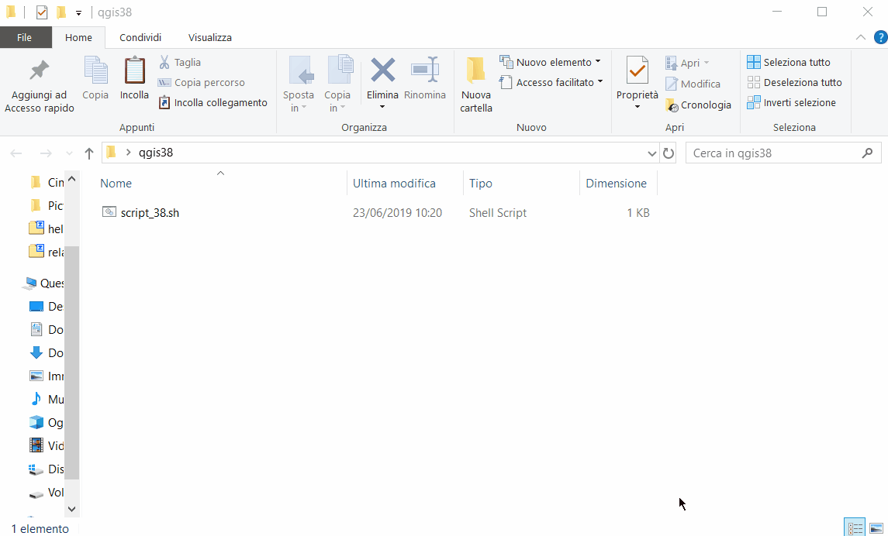

## descrizione script

Il file eseguibile (per esempio:`QGIS-OSGeo4W-3.4.9-1-Setup-x86_64.exe`) è un file zippato, per unzipparlo in ambiente linux occorre installare un tool, io ho scelto [questo](https://manpages.debian.org/jessie/p7zip-full/7za.1.en.html):

per installarlo in linux:

`sudo apt-get install p7zip-full`

---

**script:**


```bash
#!/bin/bash

set -x
# variabile con nome versione
versione=QGIS-OSGeo4W-3.4.9-1-Setup-x86_64
# scarico il file eseguibile
curl http://download.osgeo.org/qgis/win64/"$versione".exe >"$versione".exe
# unzippo il file eseguibile
7z x "$versione".exe
# rinomino la cartella
mv '$_25_' OSGeo4W
# sposto la cartella
mv '$PLUGINSDIR' OSGeo4W
#cambio cartella
cd OSGeo4W/bin
# rinomino file caso LTR
mv qgis-ltr.bat.tmpl qgis-ltr.bat
# rinomino file caso non LTR
# mv qgis.bat.tmpl qgis.bat
# cambio cartella caso LTR
cd ../apps/qgis-ltr/bin
# cambio cartella caso non LTR
# cd ../apps/qgis/bin
# scarico cartella zippata
curl -L "https://github.com/pigreco/QGIS_portable_3x/raw/master/file/win64/win64.zip" >win64.zip
# unzippo cartella
7z x win64.zip
# rimuovo cartella zippata
rm win64.zip
# cambio cartella
# creo unica cartella zippata, adeguare i numeri finali
# non eseguire questo passo se volete avviare QGIS da questa posizione
cd ../../../../
7z a OSGeo4W_349.7z OSGeo4W
```

**gif animata:**

Ho creato una cartella sul desktop **qgis38** e ho copiato all'interno lo script; digito `bash` e poi `chmod +x ./script.sh` per i permessi; poi lanciare lo script `./script.sh`

<p align="center"> <a href="" target="_blank"></a>
</p>